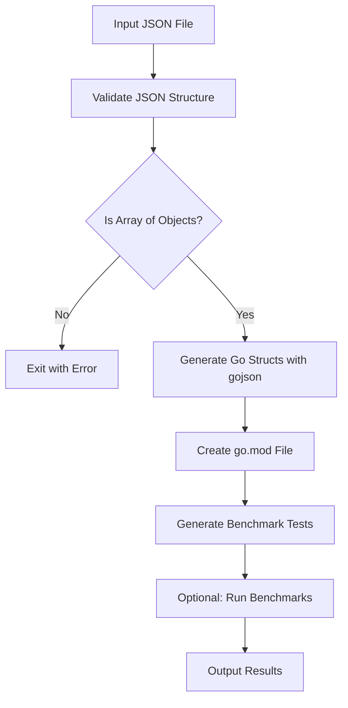

# JitJSON Performance Testing Specification

## Overview

This specification defines a comprehensive performance testing program for the [go-jitjson](https://github.com/mcwalrus/go-jitjson) library that automatically generates benchmarks comparing JitJSON performance against standard `encoding/json`.

## Requirements

### Core Requirements

1. **JSON Validation**: The program must validate that the input JSON file contains an array of objects at the root level
2. **Struct Generation**: Use the `gojson` command-line tool to automatically generate Go struct definitions from the JSON structure
3. **Benchmark Generation**: Create comprehensive benchmark tests that compare multiple scenarios
4. **Correctness Verification**: Ensure both JitJSON and standard JSON produce identical results
5. **Configurable Testing**: Allow configuration of parsing percentages and other parameters

### Technical Requirements

- **Go Version**: 1.18+ (for generics support)
- **Dependencies**: 
  - `github.com/mcwalrus/go-jitjson` (automatically managed)
  - `gojson` CLI tool for struct generation
- **JSON Constraint**: Only array of objects allowed as input format
- **Output**: Self-contained benchmark package with all necessary files

## Architecture

### Program Flow



### Component Specifications

#### 1. JSON Validator (`validateJSONStructure`)

**Purpose**: Ensure input JSON meets requirements

**Requirements**:
- Must be valid JSON
- Root level must be an array
- Array must not be empty
- All array elements must be objects (not primitives or arrays)

**Error Handling**:
- Invalid JSON format
- Non-array root structure
- Empty arrays
- Mixed types in array

#### 2. Struct Generator (`generateStructsWithGoJSON`)

**Purpose**: Generate Go struct definitions using gojson CLI

**Requirements**:
- Check for gojson installation
- Execute gojson with proper parameters
- Generate structs with configurable names
- Handle gojson execution errors

**Parameters**:
- `-name`: Struct name (configurable)
- `-pkg`: Package name (configurable)  
- `-input`: JSON file path
- `-o`: Output file path

#### 3. Benchmark Generator (`generateBenchmarkCode`)

**Purpose**: Create comprehensive benchmark test suite

**Required Benchmarks**:

1. **`BenchmarkStandardJSON`**
   - Baseline performance using `encoding/json`
   - Parse all data immediately
   - Measure time and memory allocations

2. **`BenchmarkJitJSON`**
   - JitJSON with full data parsing
   - Shows overhead when parsing everything
   - Compare against baseline

3. **`BenchmarkJitJSONPartial`**
   - JitJSON with configurable parse percentage
   - Demonstrates deferred parsing benefits
   - Supports `PARSE_PERCENTAGE` environment variable

4. **`BenchmarkJitJSONMemory`**
   - Focus on memory allocation patterns
   - JitJSON without actual parsing
   - Use `b.ReportAllocs()`

5. **`BenchmarkStandardJSONMemory`**
   - Standard JSON memory allocation baseline
   - Compare allocation patterns

**Required Tests**:

1. **`TestJitJSONCorrectness`**
   - Verify both approaches produce identical results
   - Compare marshaled output for correctness
   - Test subset of data for performance

#### 4. Module Generator (`createGoMod`)

**Purpose**: Create self-contained Go module

**Requirements**:
- Generate `go.mod` with appropriate module name
- Include `go-jitjson` dependency
- Set minimum Go version (1.21)
- Allow for automatic `go mod tidy`

### Configuration Specification

#### Command Line Interface

```
Usage: go run main.go -json <path-to-json-file> [options]

Required:
  -json string
        Path to JSON file containing array of objects (required)

Optional:
  -output string
        Output directory for generated files (default "benchmark_output")
  -struct string
        Name for the generated struct (default "Item")
  -package string
        Package name for generated code (default "benchmarks")
  -parse-percent float
        Default percentage of data to parse in partial benchmarks (0.0-1.0) (default 0.3)
  -run
        Run benchmarks after generation (default false)
```

#### Environment Variables

- `PARSE_PERCENTAGE`: Override default parse percentage for partial benchmarks (0.0-1.0)

### Output Specification

#### Generated Files

1. **`generated_structs.go`**
   - Go struct definitions from gojson
   - Proper JSON tags
   - Package declaration matching configuration

2. **`benchmark_test.go`**
   - All benchmark functions
   - Correctness test
   - Helper functions for parse percentage calculation
   - Proper imports and package declaration

3. **`go.mod`**
   - Module declaration
   - Go version requirement
   - JitJSON dependency

#### Directory Structure

```
benchmark_output/
├── go.mod
├── generated_structs.go
└── benchmark_test.go
```

### Performance Testing Scenarios

#### Scenario 1: Full Parsing Comparison
- Compare JitJSON vs standard JSON when parsing 100% of data
- Measure both time and memory overhead
- Expected: JitJSON slightly slower due to indirection

#### Scenario 2: Partial Parsing Benefits
- Test with various parse percentages (10%, 30%, 50%, 70%, 90%)
- Demonstrate JitJSON benefits with reduced parsing
- Expected: Significant performance gains at lower percentages

#### Scenario 3: Memory Efficiency
- Compare memory allocation patterns
- Focus on GC pressure and peak memory usage
- Expected: JitJSON lower memory usage with partial parsing

#### Scenario 4: Correctness Verification
- Ensure identical output between both approaches
- Test edge cases and data types
- Expected: 100% correctness match

### Error Handling Specification

#### Input Validation Errors
- **File not found**: Clear error message with file path
- **Invalid JSON**: JSON parsing error with line information
- **Wrong structure**: Specific error about array requirement
- **Empty data**: Error about minimum data requirements

#### Tool Dependency Errors
- **Missing gojson**: Installation instructions
- **gojson execution failure**: Command output and suggestions
- **Go module errors**: Module creation and dependency issues

#### Runtime Errors
- **Benchmark execution failure**: Clear error messages
- **Correctness test failure**: Detailed diff information
- **Memory allocation issues**: Resource constraint guidance

### Success Criteria

#### Functional Requirements
- ✅ Successfully validates JSON structure
- ✅ Generates accurate Go structs using gojson
- ✅ Creates comprehensive benchmark suite
- ✅ Produces identical results between JitJSON and standard JSON
- ✅ Supports configurable testing parameters

#### Performance Requirements
- ✅ Demonstrates JitJSON benefits in partial parsing scenarios
- ✅ Shows memory efficiency improvements
- ✅ Provides accurate timing measurements
- ✅ Handles large datasets (tested up to 100k+ objects)

#### Usability Requirements
- ✅ Simple command-line interface
- ✅ Clear error messages and guidance
- ✅ Comprehensive documentation
- ✅ Self-contained output (no external dependencies)
- ✅ Optional automatic benchmark execution

### Testing and Validation

#### Unit Testing
- JSON validation logic
- Struct generation process
- Benchmark template generation
- Configuration handling

#### Integration Testing
- End-to-end workflow with sample data
- Various JSON structures and sizes
- Different configuration combinations
- Error scenario handling

#### Performance Validation
- Verify benchmark accuracy
- Test with known performance characteristics
- Validate memory measurement accuracy
- Confirm correctness across all scenarios

## Implementation Notes

### Key Design Decisions

1. **Template-based Generation**: Use Go templates for benchmark code generation to ensure consistency and maintainability

2. **Modular Architecture**: Separate concerns into distinct functions for validation, generation, and execution

3. **Flexible Configuration**: Command-line flags for all major parameters while maintaining sensible defaults

4. **Error-First Design**: Comprehensive error handling with actionable error messages

5. **Self-Contained Output**: Generated benchmark package requires no external files or dependencies

### Extension Points

1. **Custom Parsers**: Support for different JSON parsers (json/v2, custom implementations)
2. **Additional Benchmarks**: Memory profiling, CPU profiling, custom scenarios
3. **Output Formats**: JSON results, CSV export, graphical reports
4. **Data Generation**: Synthetic data generation for testing various scenarios

This specification provides a complete blueprint for implementing a robust performance testing tool for the go-jitjson library that meets all stated requirements while maintaining flexibility for future enhancements.
